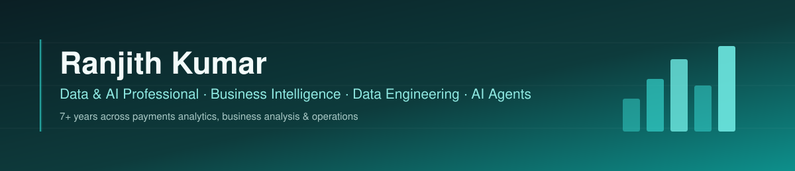

<div align="center">



<a href="https://git.io/typing-svg">
  
</a>

<br>

[](mailto:ranjithbabu3097@gmail.com)
[](https://linkedin.com/in/rkpb97)

<sub>📍 Manchester, UK &nbsp;·&nbsp; MSc International Business Management, University of Leicester</sub>

<br>

<p>
<a href="#about"></a>
<a href="#stack"></a>
<a href="#highlights"></a>
<a href="#projects"></a>
<a href="#experience"></a>
<a href="#learning"></a>
<a href="#connect"></a>
</p>

</div>

<br>

## 🧭 About <a id="about"></a>

I'm a Data & AI professional with 7+ years across data analytics, business analysis, operations, financial services and entrepreneurship. I've worked high-volume payment transaction data in a payments environment — built the dashboards Finance and Fraud teams actually relied on, not just ones that looked good in a demo.

More recently I've been extending that into directing AI agents: using Claude Code to build human-in-the-loop controls and MCP-based integrations for real business workflows, and founding a UK e-commerce brand where I run commercial decisions off my own KPI reporting.

<br>

## 🧰 Stack <a id="stack"></a>

<div align="center">

**Data & BI**
<br>


**Data Engineering & Cloud**
<br>


**Programming**
<br>


**AI & Automation**
<br>


**Business & Transformation**
<br>


</div>

<br>

## 📈 Highlights <a id="highlights"></a>

<div align="center">

| ⏱️ | 📊 | 🚚 | 👥 |
|:---:|:---:|:---:|:---:|
| **7+ yrs** data, BI & operations | **35s → 6s** dashboard load time | **98%** on-time delivery | **30–50** people coordinated |

</div>

<table>
<tr>
<td width="50%" valign="top">

**⚡ Dashboard load time: 35s → 6s**
Optimised a Power BI data model and incremental refresh approach in a payments environment — cut load time by over 80%.

</td>
<td width="50%" valign="top">

**🕒 Reporting: 2 days → 15 minutes**
Automated recurring Excel reporting for high-volume payment transaction data, cutting prep time from around two days to ~15 minutes.

</td>
</tr>
<tr>
<td width="50%" valign="top">

**📦 98% on-time delivery**
Introduced structured workflows and KPI monitoring across procurement, logistics and distribution — improved order fulfilment accuracy by 15%.

</td>
<td width="50%" valign="top">

**💰 12% cost reduction**
Delivered 10–15% annual savings through supplier and operational process improvements.

</td>
</tr>
</table>

<br>

## 🚀 Featured Projects <a id="projects"></a>

<table>
<tr>
<td width="50%" valign="top">

### 💳 Payments Analytics Dashboard
`SQL` `Power BI style modelling` `DAX-equivalent measures`

Interactive dashboard recreating the kind of transaction, approval-rate and fraud-trend reporting I built in a live payments environment at Signovate Technologies — star-schema modelling over transaction data, merchant performance, and revenue trends.

**[→ Live Dashboard](https://babu3097.github.io/payments-analytics-dashboard/)** &nbsp;·&nbsp; **[→ Repo](https://github.com/Babu3097/payments-analytics-dashboard)**

</td>
<td width="50%" valign="top">

### 🤖 jarvis — AI Safety Gate
`Claude Agent SDK` `React` `TypeScript`

Added a tap-to-approve safety gate to an AI voice assistant, so no effectful action (shell, file write, send) runs without an explicit human decision. Case study in risk & controls design.

**[→ Repo](https://github.com/Babu3097/jarvis)**

</td>
</tr>
<tr>
<td colspan="2" valign="top">

### 🎯 GTM AI Agents
`Claude Code` `Agent Skills`

Directed a library of AI marketing agents (ad creative, SEO, pricing, customer research) for a live DTC e-commerce brand — business context I author governs every agent, every output reviewed before it ships.

**[→ Repo](https://github.com/Babu3097/gtm-ai-agents)**

</td>
</tr>
</table>

<br>

## 💼 Experience <a id="experience"></a>

```
2026 ── Present    Founder · Whispered Notes Limited
2024 ── 2025       Research Assistant · University of Leicester
2023 ── 2023       Business Analyst · Signovate Technologies
2019 ── 2023       Data Analyst · Signovate Technologies
2014 ── 2018       Operations Manager · Sri Venkateshwara Earth Movers
```

<details open>
<summary><b>Founder</b> · Whispered Notes Limited &nbsp; <code>2026 – Present</code></summary>
<br>

- Lead a UK e-commerce business across customer experience, suppliers, inventory, orders, website operations and commercial decisions
- Use market, competitor and customer analysis to inform product pricing and commercial decisions
- Build KPI reporting with Power BI and Excel; develop AI-agent workflows for marketing and business automation
- Use MCP to connect AI workflows with Meta Ads Manager and TikTok Ads Manager

</details>

<details>
<summary><b>Research Assistant</b> · University of Leicester &nbsp; <code>Feb 2024 – Jan 2025</code></summary>
<br>

- Supported research into sustainability and fairness in UK food and agricultural supply chains, coordinating information from 100+ stakeholders
- Collected, reviewed and analysed evidence from 50+ sources, translating findings into structured outputs

</details>

<details>
<summary><b>Business Analyst</b> · Signovate Technologies &nbsp; <code>Apr 2023 – Dec 2023</code></summary>
<br>

- Promoted from Data Analyst in a payments environment, working with Finance, Operations, Fraud and Merchant stakeholders
- Facilitated requirements discussions and translated business needs into BRDs, FRDs, process flows, user stories and acceptance criteria
- Supported UAT, issue investigation and Jira defect tracking through delivery
- Optimised a Power BI data model and incremental refresh approach, reducing dashboard load time from ~35 seconds to under 6 seconds

</details>

<details>
<summary><b>Data Analyst</b> · Signovate Technologies &nbsp; <code>Dec 2019 – Mar 2023</code></summary>
<br>

- Analysed high-volume payment transaction data using SQL, Power BI, Excel and Python
- Built Power BI dashboards using star-schema modelling, DAX and Power Query — transactions, approval rates, fraud trends, merchant performance, revenue
- Automated recurring Excel reporting, cutting prep time from ~2 days to ~15 minutes
- Used Datadog monitoring and alerts to support identification of unusual activity

</details>

<details>
<summary><b>Operations Manager</b> · Sri Venkateshwara Earth Movers &nbsp; <code>Apr 2014 – Apr 2018</code></summary>
<br>

- Managed day-to-day operations, coordinating 30–50 workers across procurement, logistics, inventory and distribution
- Introduced structured workflows and KPI monitoring — 18% improvement in operational efficiency
- Achieved 98% on-time delivery and improved order fulfilment accuracy by 15%
- Delivered 12% cost reduction and 10–15% annual savings through supplier and process improvements

</details>

<br>

## 🌱 Currently Learning <a id="learning"></a>

<div align="center">


</div>

<br>

## 🎓 Education & Certifications

<table>
<tr>
<td valign="top" width="50%">

**Education**
- MSc International Business Management — University of Leicester `2024–2025`
- BEng Mechanical Engineering — Vel Tech, Chennai `2015–2019`

</td>
<td valign="top" width="50%">

**Certifications** (Udemy)
- Data Engineering Bootcamp
- Azure Databricks and Spark for Data Engineering — Hands-on Project

</td>
</tr>
</table>

<br>

## 📩 Connect <a id="connect"></a>

<div align="center">

Open to Business Analyst, AI Business Analyst, Data Analyst and related management roles — always happy to talk data modelling, BI, or AI-directed workflows.

[](https://linkedin.com/in/rkpb97)
[](mailto:ranjithbabu3097@gmail.com)

<br><br>


</div>
